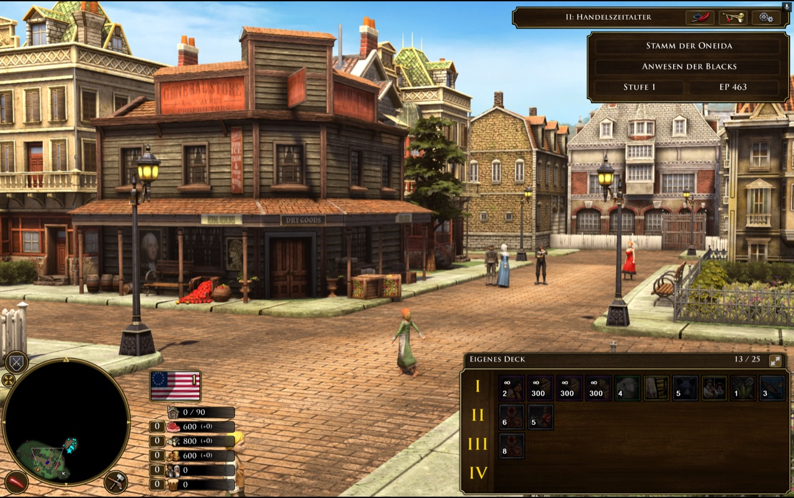
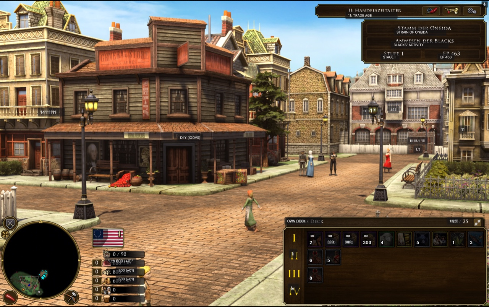
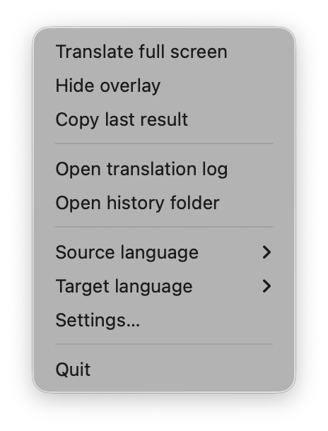
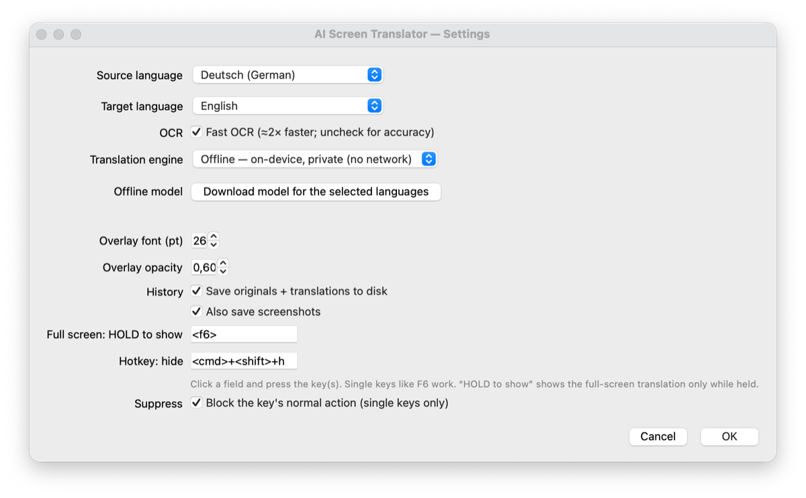

# AI Screen Translator

Hold a key (default **`F6`**) while playing a game — or reading anything on screen —
and a translation of the whole screen appears in an overlay over the original, only
while you hold it. Like Google Lens, for your entire screen.

**Free · open source (MIT) · offline by default · macOS, Windows & Linux.**

| Original (a game's untranslated UI) | Hold `F6` → translated in place |
|:---:|:---:|
|  |  |

## Run it

| Platform | How to launch |
|---|---|
| **macOS** | double-click **`run.command`** — or run `./run.sh` |
| **Windows** | double-click **`run.bat`** |
| **Linux** (X11) | run **`./run.sh`** |

The first run sets everything up automatically — a one-time ~1 GB download (the
offline engine + language pack); later launches start in seconds. Needs Python 3.9+
(Windows installs it for you via winget; macOS/Linux tell you how if it's missing).
*macOS is the most-tested target; Windows and Linux are newer.*

**Setup notes**

- **macOS** — grant **Screen Recording** and **Accessibility** in System Settings →
  Privacy & Security when prompted, then relaunch.
- **Linux** — on Debian/Ubuntu you may also need
  `sudo apt install libxcb-xinerama0 libxcb-cursor0`.

## Highlights

- 🎮 **Hold-to-translate the whole screen** — OCRs every block of text and draws the
  translation in a box over the original; release to go back.
- 🔒 **Offline & private by default** — translation runs on-device (Argos Translate),
  so nothing leaves your machine. A free Google online mode is there if you want it.
- 🌍 **25 languages** — Japanese, Chinese, Korean, Russian, German, French, and more.
- 🕹️ **Works over fullscreen games**, including GeForce Now and cloud gaming.
- 💾 **Every translation is saved** to a local, searchable page you can read after
  closing the game.

## How to use

1. Pick a **Source** and **Target** language from the menu-bar **`文`** icon
   (or **Settings…**).
2. **Hold `F6`** — the whole screen is translated in place while held; release to
   hide. (`Cmd+Shift+H` hides the overlay; both hotkeys are reassignable.)

The tray menu and the Settings window:

Every translation is saved automatically — **Translator → Open translation log**
opens a browsable, copyable page of every *Original | Translation* pair that still
works with the app closed.

## Privacy

By default **nothing leaves your machine** — translation is on-device. The optional
**Google** engine sends on-screen text to Google over the internet, and asks for
confirmation before you switch to it. History (text + screenshots) is stored locally
and owner-only.

## License

[MIT](LICENSE).
